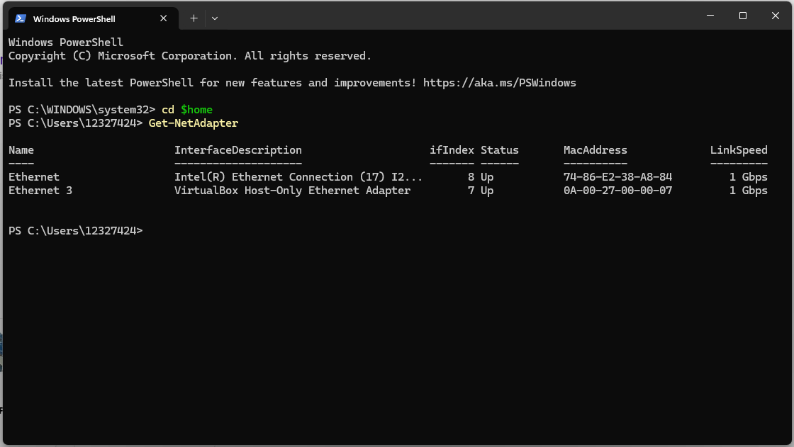
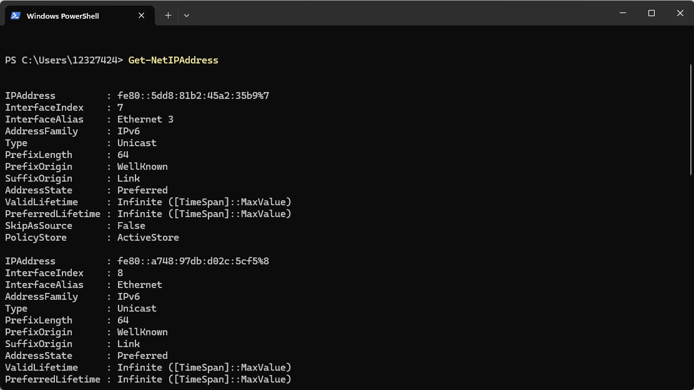
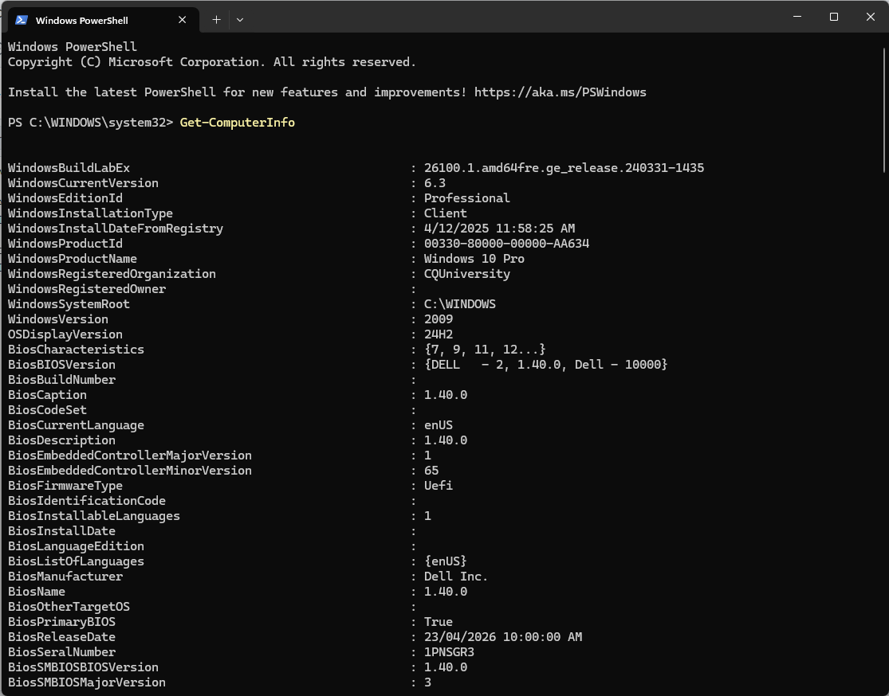
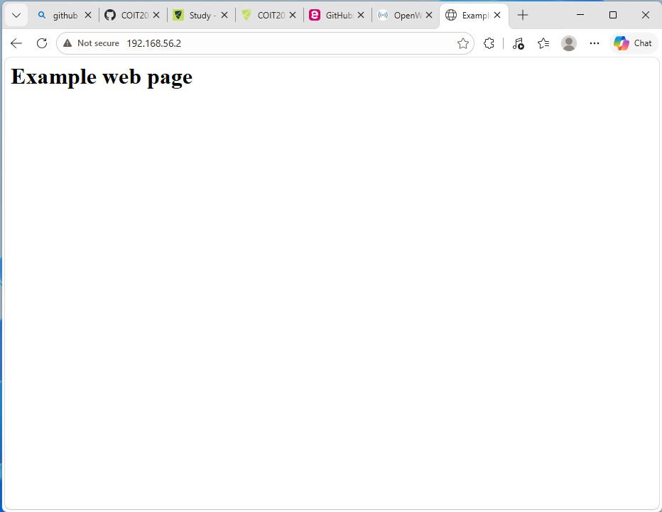
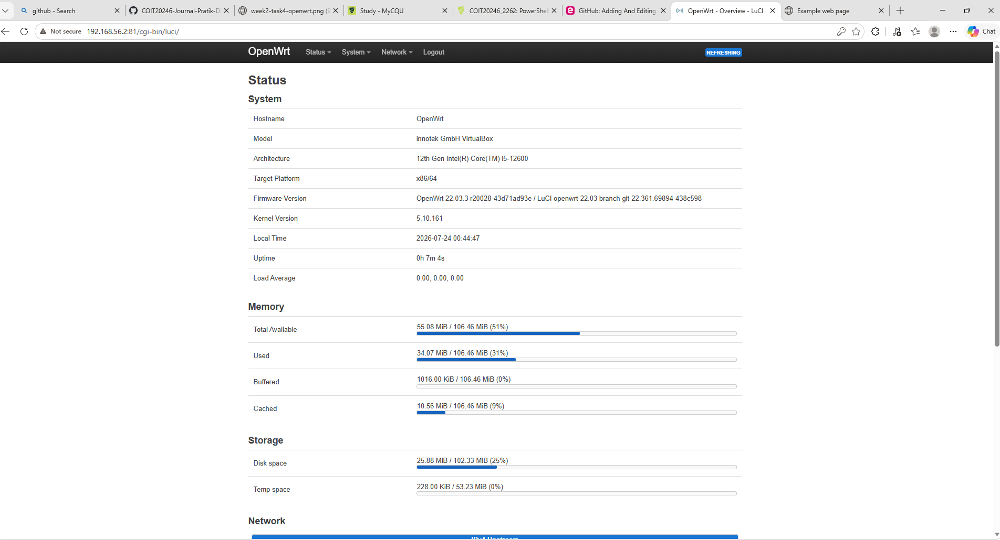
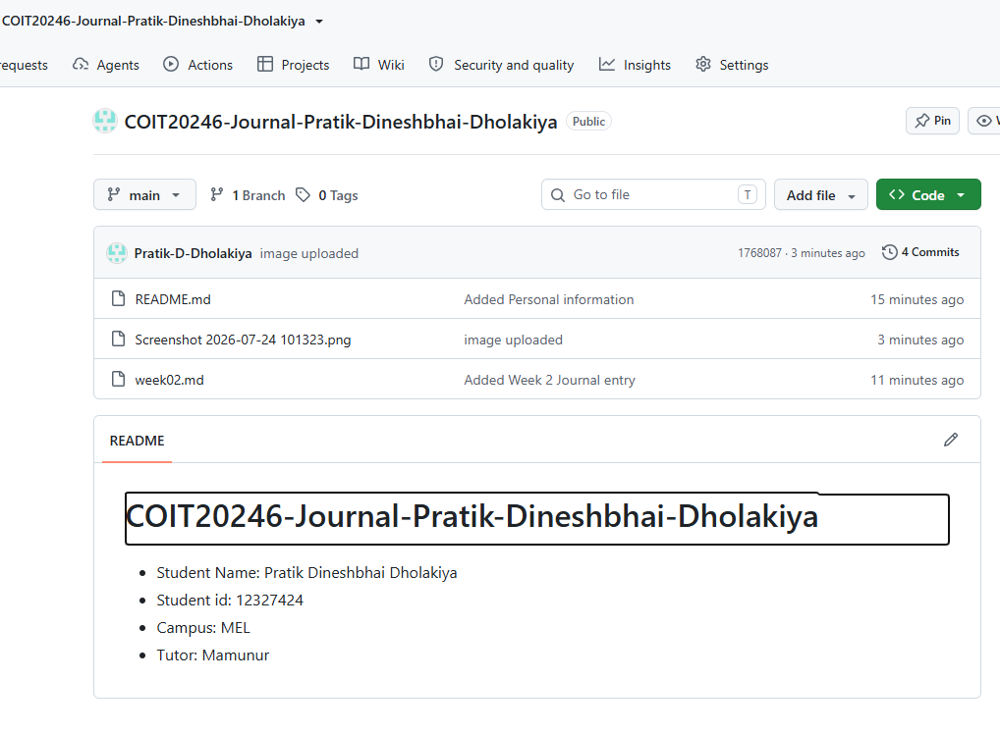

# Week 3 Journal

- Task 1 : View Your Addresses

- Task 2 : Ping Your Local Router
- 

- Task 3 : Ping Your Local Router
- 

- Task 4 : Ping your OpenWRT Linux Server
- 

- Task 5 : View Your Addresses
- 

- Task 6 : Find Addresses of a Website
- 

- Task 7 : Home Internet Connection
- 

