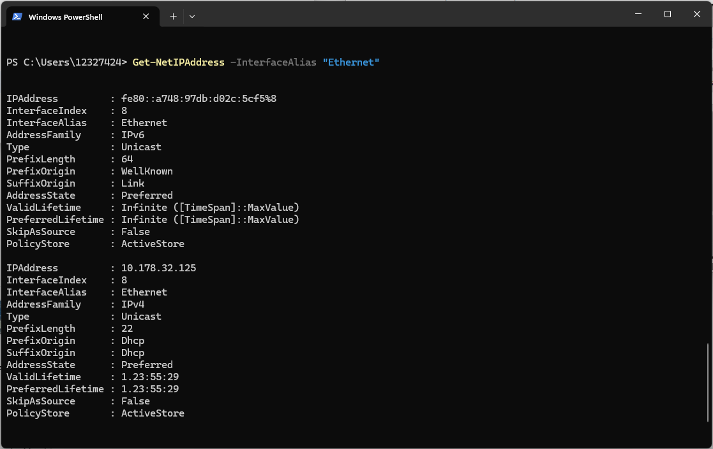
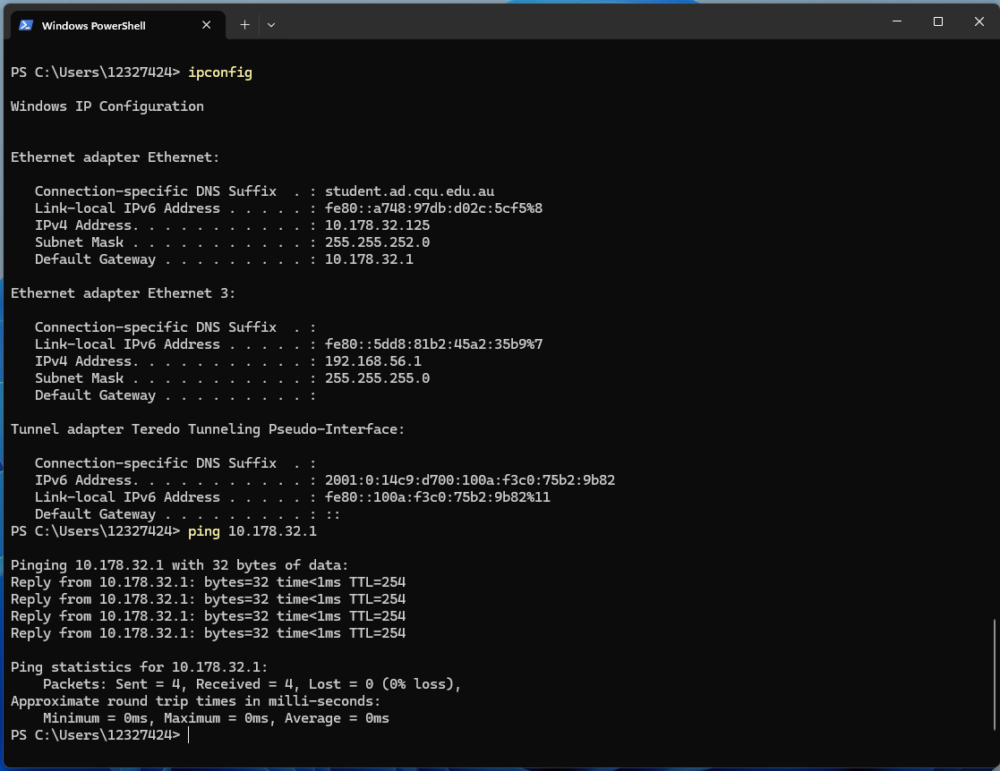
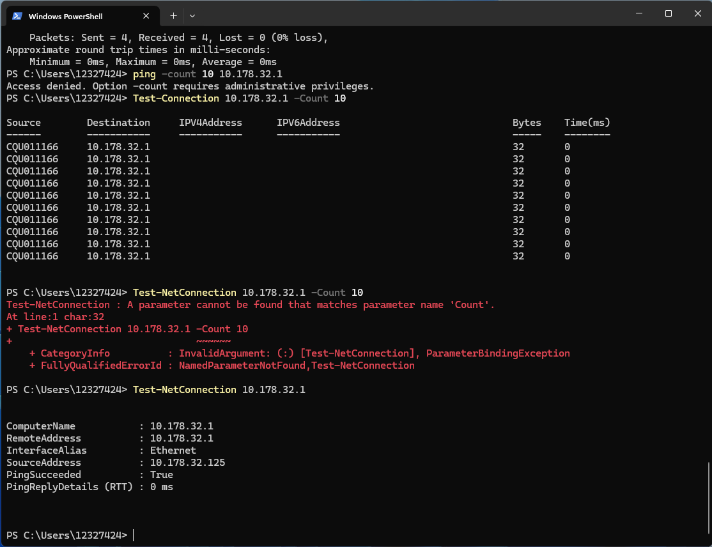

# Week 3 Journal

- ## Task 2 : View Your Addresses
- ### Get-NetAdapter
- 
- ### Get-NetIPAddress
- 
- ### Get-NetIPAddress -InterfaceAlias "Ethernet"
- 
- IPv4 Address (Ethernet) : 10.178.32.125 - Identifies my computer on the local network.
- IPv6 Address (Ethernet) : fe80::a748:97db:d02c:5cf5%8 - An IPv6 address used to identify my device on the network.
- MAC Address (Ethernet) : 74-86-E2-38-A8-84 - Unique hardware address of the physical network adapter.

- ### Get-NetIPAddress -InterfaceAlias "Ethernet 3"
- 
- IPv4 Address (Ethernet 3) : 192.168.56.1 - Identifies the VirtualBox Host-Only Adapter on the local virtual network.
- IPv6 Address (Ethernet 3) : fe80::5dd8:81b2:45a2:35b9%7 - An IPv6 address used to identify the VirtualBox Host-Only Adapter on the network.
- MAC Address (Ethernet 3) : 0A-00-27-00-00-07 - Unique hardware address of the VirtualBox virtual network adapter.

- ## Task 3 : Ping Your Local Router
- 
- 
- Router IP Address (Default Gateway): 10.178.32.1
- Minimum Delay: 0 ms
- Average Delay: 0 ms
- Maximum Delay: 0 ms
- Packet Loss: 0%
- After testing the ping command to test connectivity. The router responded successfully with 0 ms minimum, average, and maximum delay, indicating a very fast local network connection.

- ## Task 4 : Ping your OpenWRT Linux Server
- 

- ## Task 6 : Find Addresses of a Website
- 

- ## Task 7 : Home Internet Connection
- 

