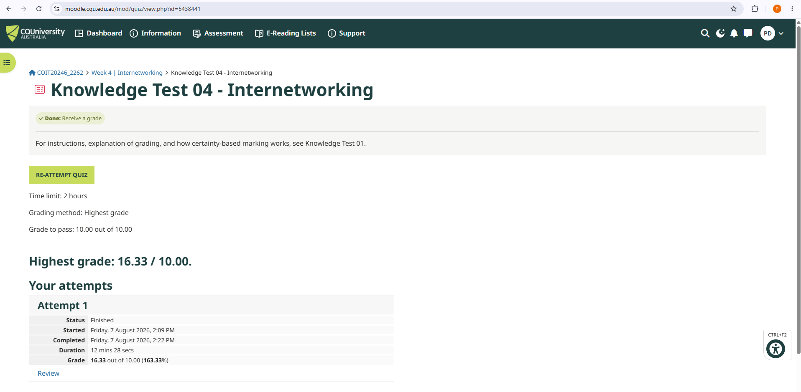
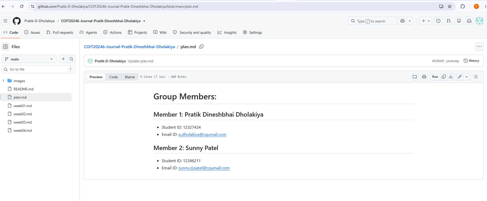
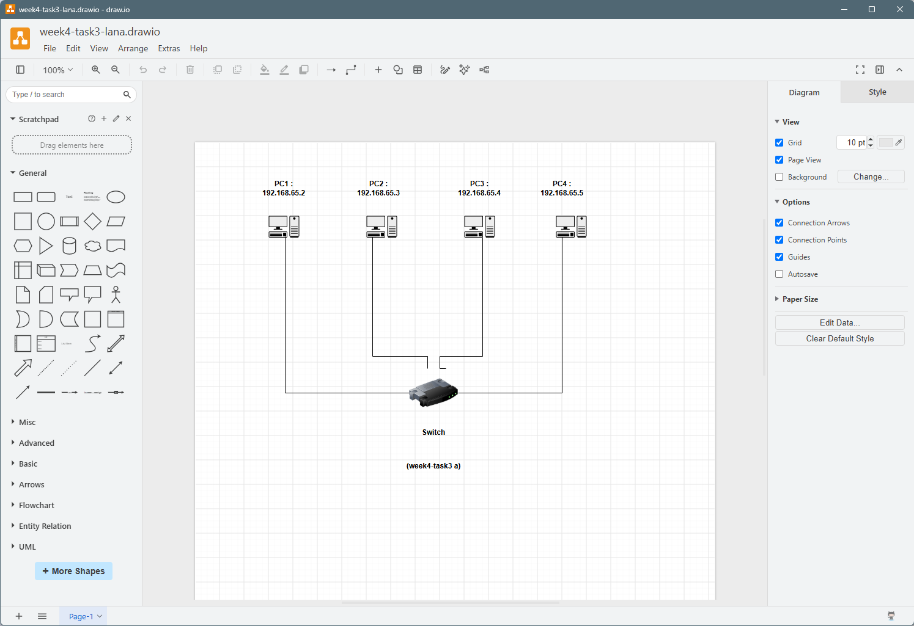
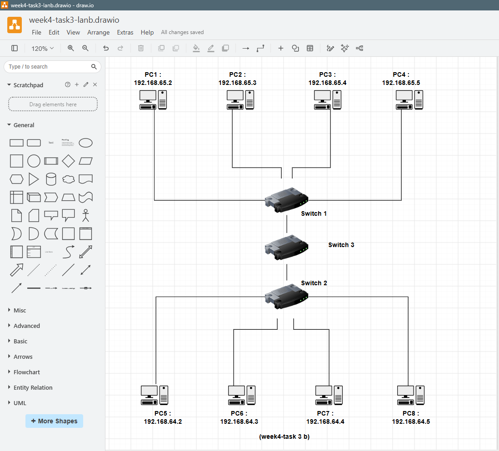
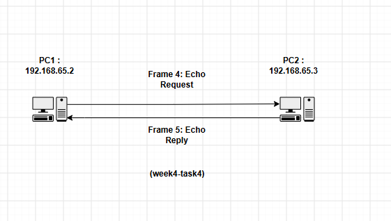
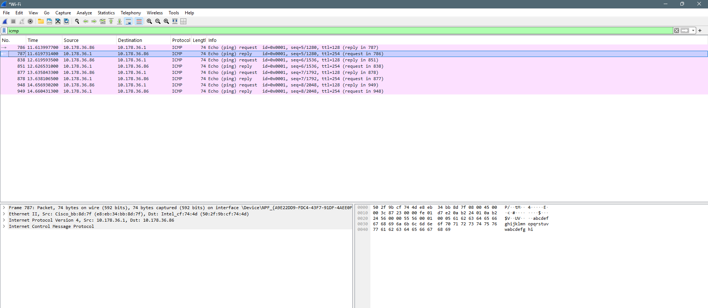

# Week 4 Journal

## Task 1 : Completed knowledge test

### Task 2 — Project Initiation

## Task 3 : Draw Network Diagrams
#### Diagram 1 — Switched LAN

The first network diagram contains:

- 1 network switch
- 4 PCs
- Each PC is directly connected to the switch.

#### Diagram 2 — Switched LAN with Multiple Switches

The second network diagram contains:

- 3 network switches
- 8 PCs
- The devices are arranged using a star network arrangement.

#### Tool Used : The network diagrams were created using **draw.io (diagrams.net)**.

## Task 4 : Analyse Ping Packet Capture

### Network Diagram

The network diagram shows the communication between the Windows host and the network gateway using ICMP ping.

- **Windows Host IP Address:** 10.178.36.86
- **Windows Host MAC Address:** 50:2f:9b:cf:74:4d
- **Network Gateway IP Address:** 10.178.36.1
- **Network Gateway MAC Address:** e8:eb:34:bb:8d:7f
- **Network:** Wi-Fi

In the packets captured the Windows host is communicating with the network gateway.

### ARP Packets

The Address Resolution Protocol (ARP) is employed to discover the MAC address of a network node that has a known IP address in the local network.

In the packet capture, the Windows host is talking to the network gateway (10.178.36.1). To send Ethernet frames to the right device, the ARP process is used to find out the gateway's MAC address.

The ARP information can be seen in the ARP table. The gateway has the MAC address e8:eb:34:bb:8d:7f.

The function of ARP is to convert an IPv4 address to a MAC address in the local network.

The first two ICMP packets are ignored.

The first 2 ICMP packets are ICMP Echo Request and ICMP Echo Reply.

- **First packet:** ICMP Echo Request
  - Source IP: 10.178.36.86
  - Destination IP: 10.178.36.1
  - Protocol: ICMP
  - Length: 74 bytes
  - Description: The Windows host requests to determine if the network gateway can be reached.

- **Second packet:** ICMP Echo Reply
  - Source IP: 10.178.36.1
  - Destination IP: 10.178.36.86
  - Protocol: ICMP
  - Length: 74 bytes
  - Purpose: The network gateway responds to the Ping request, indicating that the host can communicate with the network gateway.

- The Wireshark capture shows that the ICMP Echo Request and Echo Reply are successfully exchanged between the two devices.

### Packet Encapsulation

- The ICMP packet is placed in an IPv4 packet and the IPv4 packet is placed in an Ethernet frame.

- The packet is composed of the following layers:

1. Ethernet II header
2. IPv4 header
3. ICMP header
4. ICMP data

- There are 74 bytes of the complete captured packet.

### Packet Diagram

- The Wireshark packet capture shows the Ethernet II, IPv4 and ICMP layers. The ICMP Echo Request includes ping data from the Windows host to the network gateway.

### Wireshark Evidence

- The Wireshark capture shows the ICMP Echo Request and Echo Reply packets with the src and dest interfaces between the host **10.178.36.86** and host **10.178.36.1**.

