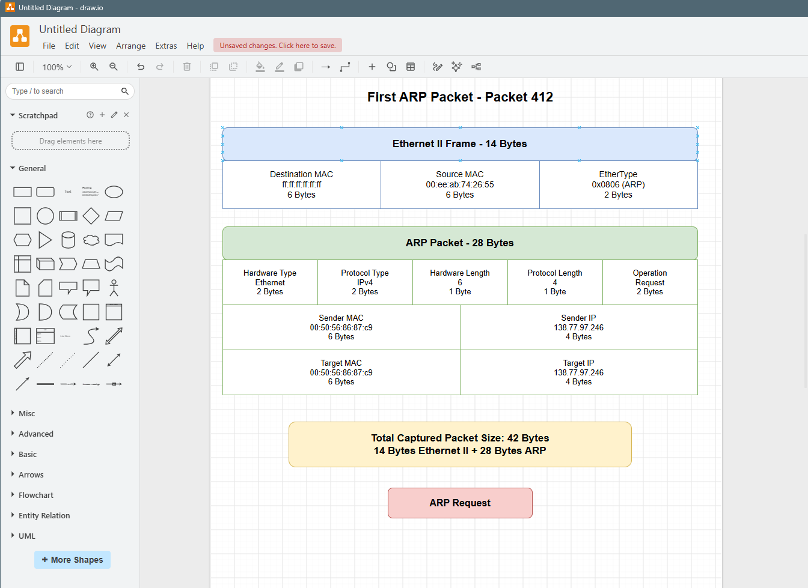
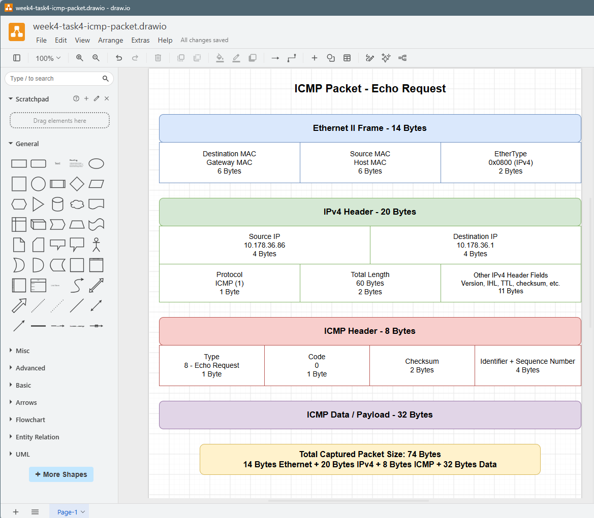

# Week 4 Journal

### Task 2 — Project Initiation

## Task 3 : Draw Network Diagrams
#### Diagram 1 — Switched LAN

The first network diagram contains:

- 1 network switch
- 4 PCs
- Each PC is directly connected to the switch.

#### Diagram 2 — Switched LAN with Multiple Switches

The second network diagram contains:

- 3 network switches
- 8 PCs
- The devices are arranged using a star network arrangement.

#### Tool Used : The network diagrams were created using **draw.io (diagrams.net)**.

## Task 4 : Analyse Ping Packet Capture

### Network Diagram

The network diagram shows the communication between the Windows host and the network gateway using ICMP ping.

- **Windows Host IP Address:** 10.178.36.86
- **Windows Host MAC Address:** 50:2f:9b:cf:74:4d
- **Network Gateway IP Address:** 10.178.36.1
- **Network Gateway MAC Address:** e8:eb:34:bb:8d:7f
- **Network:** Wi-Fi

### ARP Packets

ARP (Address Resolution Protocol) is used to find the MAC address associated with an IP address on the local network.

In the packet capture, the Windows host communicates with the network gateway at **10.178.36.1**. The ARP process is used to determine the MAC address of the gateway so that Ethernet frames can be sent to the correct device.

The purpose of ARP is to map an IPv4 address to a MAC address on the local network.

### First Two ICMP Packets

The first two ICMP packets are an ICMP Echo Request and an ICMP Echo Reply.

- **First packet:** ICMP Echo Request
  - Source IP: 10.178.36.86
  - Destination IP: 10.178.36.1
  - Protocol: ICMP
  - Length: 74 bytes

- **Second packet:** ICMP Echo Reply
  - Source IP: 10.178.36.1
  - Destination IP: 10.178.36.86
  - Protocol: ICMP
  - Length: 74 bytes

The ICMP Echo Request is sent by the Windows host to check whether the network gateway is reachable. The ICMP Echo Reply is sent by the gateway in response to the request.

### Wireshark Evidence

The Wireshark capture shows the ICMP Echo Request and ICMP Echo Reply packets between **10.178.36.86** and **10.178.36.1**.

### Packet Diagram for ARP

### Packet Diagram for ICMP

- The Wireshark capture shows the ICMP Echo Request and Echo Reply packets with the src and dest interfaces between the host **10.178.36.86** and host **10.178.36.1**.

