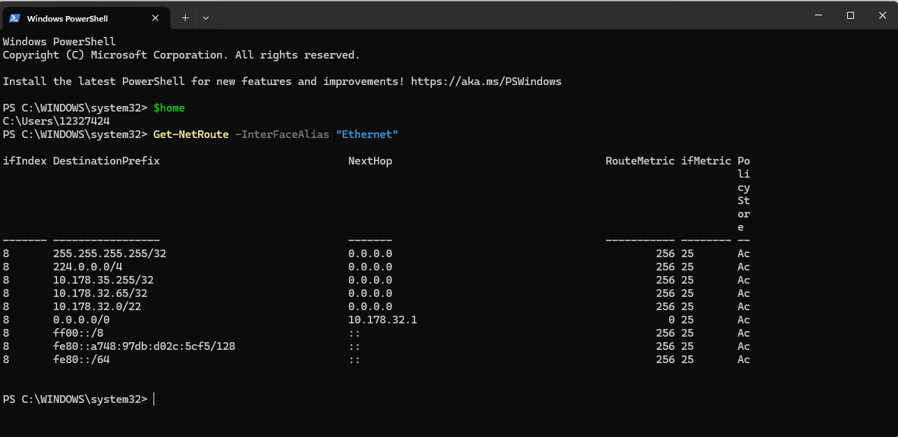
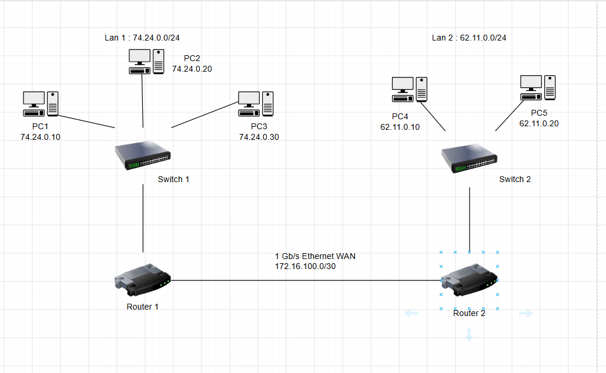

# Week 5 Journal

## Task 1 : Completed knowledge test

## Task 2 : View Routing Table
### Command Used:
-  Get-NetRoute -InterFaceAlias "Ethernet"

## Task 3 : View Your Addresses  

#### Table of Devices, Interfaces, and Assigned IPs
| Device | Interface | IP Address | Subnet Mask / Prefix | Gateway / Notes |
| :--- | :--- | :--- | :--- | :--- |
| **PC1** | NIC | 74.24.0.10 | 255.255.255.0 (/24) | 74.24.0.1 |
| **PC2** | NIC | 74.24.0.20 | 255.255.255.0 (/24) | 74.24.0.1 |
| **PC3** | NIC | 74.24.0.30 | 255.255.255.0 (/24) | 74.24.0.1 |
| **Router 1** | Fa0/0 (LAN A) | 74.24.0.1 | 255.255.255.0 (/24) | Default Gateway for LAN A |
| **Router 1** | Se0/0 (WAN) | 172.16.100.1 | 255.255.255.252 (/30) | Point-to-point to Router 2 |
| **Router 2** | Se0/0 (WAN) | 172.16.100.2 | 255.255.255.252 (/30) | Point-to-point to Router 1 |
| **Router 2** | Fa0/0 (LAN B) | 56.78.0.1 | 255.255.255.0 (/24) | Default Gateway for LAN B |
| **PC4** | NIC | 56.78.0.10 | 255.255.255.0 (/24) | 56.78.0.1 |
| **PC5** | NIC | 56.78.0.20 | 255.255.255.0 (/24) | 56.78.0.1 |

#### Router 1 Routing Table
| Network Destination | Netmask | Gateway (Next Hop) | Interface |
| :--- | :--- | :--- | :--- |
| 74.24.0.0 | 255.255.255.0 | 0.0.0.0 (Direct) | Fa0/0 |
| 172.16.100.0 | 255.255.255.252 | 0.0.0.0 (Direct) | Se0/0 |
| 10.0.56.0 | 255.255.255.0 | 172.16.100.2 | Se0/0 |

#### Router 2 Routing Table
| Network Destination | Netmask | Gateway (Next Hop) | Interface |
| :--- | :--- | :--- | :--- |
| 10.0.56.0 | 255.255.255.0 | 0.0.0.0 (Direct) | Fa0/0 |
| 172.16.100.0 | 255.255.255.252 | 0.0.0.0 (Direct) | Se0/0 |
| 74.24.0.0 | 255.255.255.0 | 172.16.100.1 | Se0/0 |

