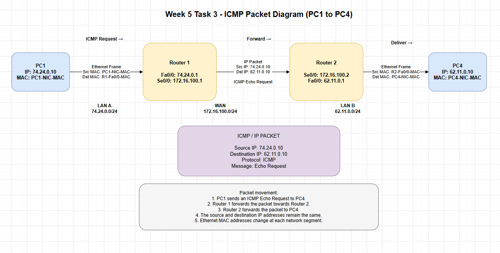

# Week 5 Journal

## Task 1 : Completed knowledge test

## Task 2 : View Routing Table
### Command Used:
-  Get-NetRoute -InterFaceAlias "Ethernet"

## Task 3 : View Your Addresses
### Team Members:
- Pratik Dineshbhai Dholakiya, ID: 12327424
- Sunny Patel, ID: 12346211
   
### Network diagram: 

### Table of Devices, Interfaces, and Assigned IPs: 
| Device | Interface | IP Address | Subnet Mask / Prefix | Gateway / Notes |
| :--- | :--- | :--- | :--- | :--- |
| **PC1** | NIC | 74.24.0.10 | 255.255.255.0 (/24) | 74.24.0.1 |
| **PC2** | NIC | 74.24.0.20 | 255.255.255.0 (/24) | 74.24.0.1 |
| **PC3** | NIC | 74.24.0.30 | 255.255.255.0 (/24) | 74.24.0.1 |
| **Router 1** | Fa0/0 (LAN A) | 74.24.0.1 | 255.255.255.0 (/24) | Default Gateway for LAN A |
| **Router 1** | Se0/0 (WAN) | 172.16.100.1 | 255.255.255.252 (/30) | Point-to-point to Router 2 |
| **Router 2** | Se0/0 (WAN) | 172.16.100.2 | 255.255.255.252 (/30) | Point-to-point to Router 1 |
| **Router 2** | Fa0/0 (LAN B) | 56.78.0.1 | 255.255.255.0 (/24) | Default Gateway for LAN B |
| **PC4** | NIC | 56.78.0.10 | 255.255.255.0 (/24) | 56.78.0.1 |
| **PC5** | NIC | 56.78.0.20 | 255.255.255.0 (/24) | 56.78.0.1 |

### Routing tables: 
- #### Router 1 Routing Table: 
| Network Destination | Netmask | Gateway (Next Hop) | Interface |
| :--- | :--- | :--- | :--- |
| 74.24.0.0 | 255.255.255.0 | 0.0.0.0 (Direct) | Fa0/0 |
| 172.16.100.0 | 255.255.255.252 | 0.0.0.0 (Direct) | Se0/0 |
| 10.0.56.0 | 255.255.255.0 | 172.16.100.2 | Se0/0 |

- #### Router 2 Routing Table: 
| Network Destination | Netmask | Gateway (Next Hop) | Interface |
| :--- | :--- | :--- | :--- |
| 10.0.56.0 | 255.255.255.0 | 0.0.0.0 (Direct) | Fa0/0 |
| 172.16.100.0 | 255.255.255.252 | 0.0.0.0 (Direct) | Se0/0 |
| 74.24.0.0 | 255.255.255.0 | 172.16.100.1 | Se0/0 |

### Packet diagram: 

## Task 4 : Academic Integrity Outcomes
- Academic Integrity Scenario – Copying from the Internet
- The scenario I could see that was most relevant was a student copying content from the Internet and submitting it for a class without giving appropriate reference. This may be plagiarism as per the CQUniversity Student Academic Integrity Policy and Procedure, where words or ideas are used without proper attribution to another person.
- The student might have solved this problem if he/she had used his/her own words, and referenced correctly all sources used, and used quotation marks when quoting, and sought assistance from the lecturer or Academic Learning Centre when unsure.
- The depth of the breach will vary depending on the situation. If the student was not in the University before, and plagiarism was unintentional, it may be a Level 1 – Inappropriate Academic Conduct. Consequences may include a written warning, a deduction of any given mark and an academic integrity education. Where the student has deliberately copied to obtain an unfair advantage this may be considered academic dishonesty at a higher level and a more serious consequence, such as marking the assessment as zero or failing the unit may result.
- I think the policy is fair as it takes into account the student's experience, intention, the level of misconduct and the impact. It also makes a difference between an honest mistake and academic dishonesty. Although a student may not be discovered right away, the violation could be noted at a later time and could impact his/her academic progress.
#### Recommendations:
- Always cite information and ideas from web pages or other sources.
- If you don't know how to do something, get others to help you with your learning or with referencing, don't copy their work.

## Task 5 : IP Address Lookup

- I used an online IP address lookup website to check my IP address on two different networks. The website determined my public IPv4 address and Internet Service Provider (ISP). It also guessed where I was as Sydney, New South Wales, Australia.
- But the location was not precise, and it didn't provide my home or computer location. This demonstrates that IP address lookup services can give a general location, however aren't exact in determining a person's precise geographical location.
- The public IP address changed, as every Internet connection has a different public IP address when a different network is used. Websites are then able to see the net public IP address, not necessarily my personal computer's IP address.

