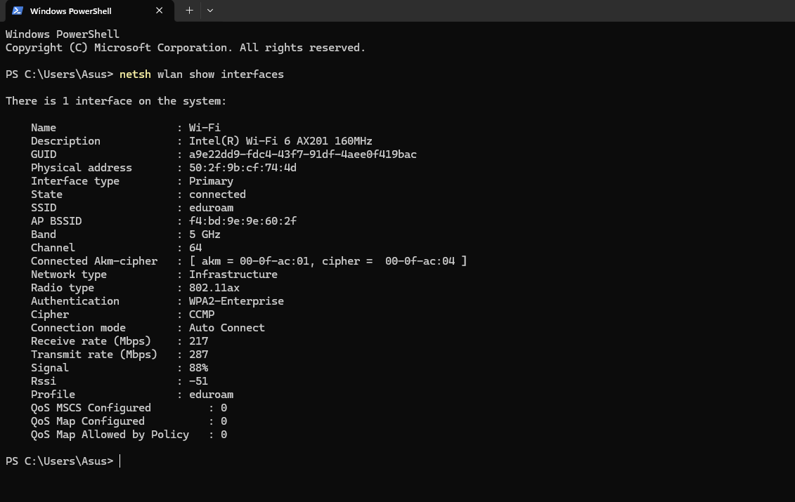
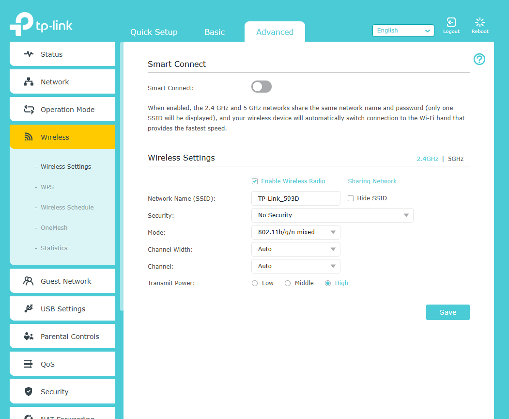
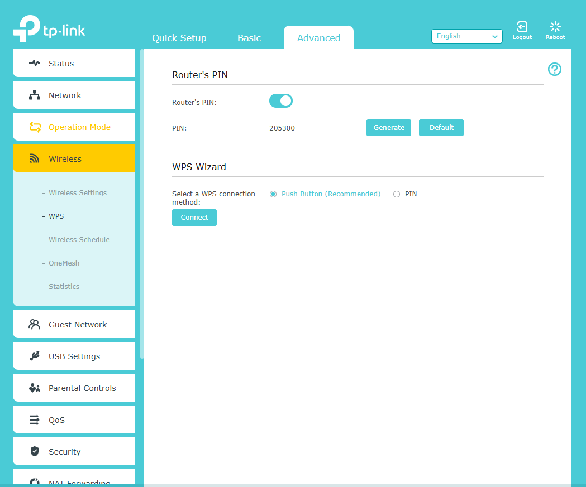

# Week 7 – Wireless Networks


## Task 2 – View Wi-Fi Details

I explored the Wi-Fi details of my Windows laptop using the Wi-Fi interface information. The device was connected to the **eduroam** wireless network.

| Parameter | Information |
|---|---|
| **SSID** | eduroam |
| **BSSID** | f4:bd:9e:9e:60:2f |
| **Frequency Band** | 5 GHz |
| **Channel** | 64 |
| **Receive Rate** | 217 Mbps |
| **Transmit Rate** | 287 Mbps |
| **Signal Strength** | 88% |
| **RSSI** | -51 dBm |
| **Network Type** | Infrastructure |
| **Radio Type** | 802.11ax |
| **Authentication** | WPA2-Enterprise |
| **Cipher** | CCMP |
| **Connection Mode** | Auto Connect |

### Discussion

The Wi-Fi connection was using the **eduroam** SSID and was operating on the **5 GHz frequency band on channel 64**. The wireless interface reported a receive rate of **217 Mbps** and a transmit rate of **287 Mbps**. The signal strength was **88%**, with an RSSI of **-51 dBm**.

The connection used **802.11ax** as the radio type. The authentication method was **WPA2-Enterprise**, with **CCMP** as the cipher. The network type was **Infrastructure**, meaning that the laptop was connected through a wireless access point.

### Screenshot Evidence

### Figure 1 – Wi-Fi Details



The screenshot shows the Wi-Fi connection information collected from the Windows laptop, including the SSID, BSSID, frequency band, channel, data rates, signal strength, authentication method and other wireless parameters.

---

## Task 3 – Use Wi-Fi Access Point

I accessed the web management interface of a TP-Link wireless router emulator and explored the available wireless configuration settings. I examined the settings for the 2.4 GHz wireless network and the WPS configuration.

### Current Access Point Settings

| Setting | Current Configuration |
|---|---|
| **Network Name (SSID)** | TP-Link_593D |
| **Wireless Radio** | Enabled |
| **Security** | No Security |
| **Wireless Mode** | 802.11b/g/n mixed |
| **Channel Width** | Auto |
| **Channel** | Auto |
| **Transmit Power** | High |
| **Smart Connect** | Disabled |
| **WPS** | Enabled |
| **WPS Connection Method** | Push Button |
| **Router PIN** | Enabled |

### Important Settings and Recommended Changes

| Setting | Current Setting | Setting I Would Use | Reason |
|---|---|---|---|
| **SSID** | TP-Link_593D | Unique and meaningful SSID | Makes the network easier to identify and avoids relying on a default-style name. |
| **Wireless Security** | No Security | WPA3-Personal, or WPA2/WPA3 if WPA3 is unavailable | Provides authentication and encryption for wireless communications. |
| **Wi-Fi Password** | Not configured | Long and unique password | Helps prevent unauthorised access to the wireless network. |
| **Wireless Mode** | 802.11b/g/n mixed | Modern supported Wi-Fi mode | Reduces reliance on outdated wireless standards where older devices are not required. |
| **Channel Width** | Auto | Appropriate width based on environment | Helps balance performance and interference. |
| **Channel** | Auto | Suitable low-interference channel | Can reduce interference from nearby wireless networks. |
| **Transmit Power** | High | Appropriate level for required coverage | Provides sufficient coverage without unnecessarily increasing interference. |
| **WPS** | Enabled | Disabled if not required | Reduces unnecessary wireless access functionality. |
| **Router PIN** | Enabled | Disabled if WPS is not required | Removes unnecessary PIN-based WPS functionality. |
| **Smart Connect** | Disabled | Enable if suitable | Can automatically manage compatible devices across available frequency bands. |

### Discussion

### Wireless Security

The current wireless security setting is **No Security**. I would change this to **WPA3-Personal** if supported by the access point and client devices. If WPA3 is unavailable, a secure WPA2/WPA3 configuration could be used.

The current configuration does not provide appropriate wireless authentication and encryption. Using a secure authentication method and a strong password would provide better protection against unauthorised access.

### SSID

The current SSID is **TP-Link_593D**. I would change this to a unique and recognisable SSID so that users can easily identify the intended wireless network.

### Wireless Password

Because wireless security is currently disabled, no wireless password is configured. After enabling an appropriate security protocol, I would configure a strong and unique password.

### Wireless Mode

The current wireless mode is **802.11b/g/n mixed**. If older devices are not required, a modern wireless mode supported by the access point and client devices could be selected to improve network efficiency.

### Channel and Channel Width

The channel and channel width are currently configured as **Auto**. Automatic selection can be useful, but in a congested wireless environment the administrator should check the surrounding wireless networks and select suitable settings to minimise interference.

### Transmit Power

The transmit power is currently set to **High**. The appropriate level should provide the required coverage without unnecessarily increasing interference with other wireless networks.

### WPS

WPS is currently enabled, including the Push Button method and router PIN. I would disable WPS when it is not required because normal wireless authentication can be performed using the SSID and secure password.

### Smart Connect

Smart Connect is currently disabled. It could be enabled where automatic management between available wireless frequency bands is appropriate for the network.

### Screenshot Evidence

### Figure 2 – TP-Link Wireless Settings



The screenshot shows the 2.4 GHz wireless configuration, including the SSID, wireless security, wireless mode, channel width, channel and transmit power settings.

### Figure 3 – TP-Link WPS Settings



The screenshot shows the WPS configuration, including the Push Button and PIN connection methods.

---

## Task 4 – Self-Evaluation of Teamwork

### Team Contribution and Reflection

My contribution to the project has mainly involved configuring and testing the OpenWrt networking environment, troubleshooting network connectivity and interface configuration issues, documenting the network configuration, and preparing evidence for the project repository. I also worked on the wireless networking tasks, including reviewing Wi-Fi details and analysing wireless access point settings.

My contribution should be compared with other team members using the GitHub commit history and the actual work completed rather than only the number of commits. Some of my work involved troubleshooting and configuring the OpenWrt environment, where the amount of practical work may not always be reflected by the number of commits.

For comparison with other teams in the class, the GitHub repository history can be used to examine total commits and the distribution of commits between team members. Commit numbers alone do not necessarily represent the significance or complexity of the work completed.

For the remainder of the project, I can improve by making smaller and more regular commits, using clear commit messages, and documenting technical work immediately after completing it. As a team, we can improve by distributing tasks clearly, communicating regularly, reviewing each other's work, and ensuring that each member makes a visible and meaningful contribution to the repository.

---

## AI Review

AI tools were used during the Week 7 project work as a support tool for troubleshooting, understanding technical concepts, and improving project documentation. The AI was not used as a replacement for practical implementation; OpenWrt configuration, VirtualBox settings, testing and verification were performed in the project environment.

### AI Interaction 1 – OpenWrt Network Troubleshooting

AI assistance was used to interpret OpenWrt terminal output during network configuration and troubleshooting. The interaction involved commands such as `ip link`, `ip addr`, `uci show network` and `ifstatus lan`.

The AI helped interpret the network interface status and identify configuration issues. The configuration was then applied and verified in the OpenWrt environment.

**Evidence:** OpenWrt terminal screenshots showing the interface configuration and verification.

### AI Interaction 2 – Network Architecture and Diagram

AI assistance was used to understand and document the VirtualBox and OpenWrt network architecture. The discussion covered the relationship between the Windows host, VirtualBox adapters, OpenWrt interfaces, and the management bridge.

This helped organise the network topology and prepare the network diagram used in the project documentation.

**Evidence:** Network architecture diagram and related project documentation.

### AI Interaction 3 – Wi-Fi and Access Point Analysis

AI assistance was used to explain the Wi-Fi information collected from the Windows laptop and to analyse the configuration of the TP-Link wireless access point emulator.

The discussion covered wireless parameters such as SSID, BSSID, frequency band, channel, signal strength, authentication, encryption, WPS and Smart Connect. This helped explain the security and configuration implications of the observed settings.

**Evidence:** Wi-Fi details and TP-Link configuration screenshots included in this document.

### AI Interaction 4 – Markdown Documentation

AI assistance was also used to organise the `network.md` documentation and place screenshot references in the appropriate sections using relative image paths.

For example:

```markdown


## Task 5 – Continue Your Project

The practical project work was continued during Week 7. The main focus was the configuration and testing of an OpenWRT-based network environment in VirtualBox.

### OpenWRT Virtual Machine

The OpenWRT virtual machine was successfully started and accessed through the terminal and LuCI web interface.

The OpenWRT environment was running:

- OpenWRT 22.03.3
- x86/64 architecture
- VirtualBox virtual machine
- LuCI web management interface

### VirtualBox Network Configuration

The virtual machine was configured with multiple network adapters to separate the different network functions.

The implemented configuration included:

| Component | Configuration |
|---|---|
| **Adapter 1** | VirtualBox Host-only Network |
| **Adapter 1 interface** | OpenWRT `eth0` |
| **Adapter 2** | VirtualBox NAT Network |
| **Adapter 2 interface** | OpenWRT `eth1` |
| **Adapter 3** | Internal Network |
| **Adapter 3 interface** | OpenWRT `eth2` |

The OpenWRT interface output confirmed that `eth0`, `eth1` and `eth2` were available after the network adapter configuration.

### Management Network

The management bridge was configured as:

| Parameter | Configuration |
|---|---|
| **Interface** | `br-mng` |
| **IPv4 Address** | `192.168.56.2/24` |
| **Physical Interface** | `eth0` |
| **Purpose** | OpenWRT management access |

The OpenWRT LuCI interface was successfully accessed through:

`http://192.168.56.2:81/cgi-bin/luci/`

### WAN Network

The WAN interface was configured using `eth1`.

| Parameter | Configuration |
|---|---|
| **Interface** | WAN |
| **Device** | `eth1` |
| **Protocol** | DHCP |
| **IPv4 Address** | `10.0.3.15/24` |

The WAN interface was successfully brought up and received an IPv4 address.

### Internal/LAN Network

The internal LAN interface was configured using `eth2`.

| Parameter | Configuration |
|---|---|
| **Interface** | LAN |
| **Device** | `eth2` |
| **Protocol** | Static |
| **IPv4 Address** | `192.168.10.1/24` |
| **Netmask** | `255.255.255.0` |

The LAN interface was successfully brought up after correcting the initial missing `eth2` network adapter configuration.

### DHCP Configuration

DHCP was configured for the internal LAN network.

The configuration included:

- DHCP start: `100`
- DHCP limit: `51`
- DHCP lease time: `12h`

The configuration was committed and the network service was restarted successfully.

### Web Server Testing

The OpenWRT system was also tested using its built-in `uhttpd` web server.

The configuration showed:

- HTTP listener: port `81`
- HTTPS listener: port `444`
- Web root: `/www/`
- LuCI CGI interface available through `/cgi-bin/luci/`

A local HTTP request was tested using:

```text
curl -I http://127.0.0.1:81
